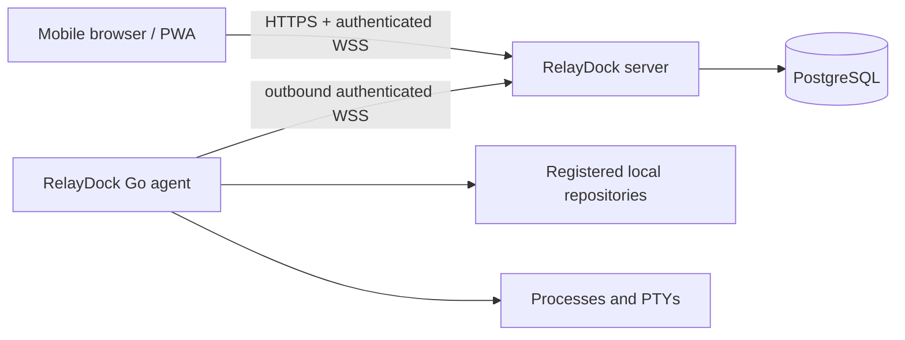

# RelayDock

> **RelayDock lets you securely run and supervise development commands on your own computers from any browser, without exposing those computers to the internet.**

RelayDock is a self-hosted command relay for developers. A small agent makes an outbound encrypted connection from a laptop to your RelayDock server. The installable mobile web app can then run approved repository actions, attach to interactive terminals, and replay output after a browser reconnects.

> [!WARNING]
> RelayDock intentionally executes commands under your local operating-system account. Host it behind TLS, keep registration closed after setup, prefer predefined actions, and treat server administrators as trusted. Read [SECURITY.md](SECURITY.md) before exposing it to the internet.

## MVP status

The project is under active MVP implementation. The source of truth for completed and still-open work is [docs/progress.md](docs/progress.md); unchecked items are not claimed as complete.

## Architecture



The browser never connects to the laptop. Fastify authorizes and relays requests, PostgreSQL stores state and output, and the Go agent owns local process lifetime. Output chunks carry monotonically increasing sequence numbers so reconnecting clients can replay only what they missed.

## Features

- Email/password sign-in with Argon2id and HttpOnly database sessions
- One-time device pairing, revocable hashed agent credentials, and permanent post-revocation removal
- Outbound-only agent connection with heartbeat and automatic reconnect
- Agent-validated repository registration
- Safer predefined actions and opt-in confirmed custom commands
- Live stdout/stderr and PTY terminal input, resize, and cancellation
- Persistent local sessions while the browser is closed
- Job history and sequence-based output replay
- Mobile-responsive installable PWA
- Docker-based self-hosting and reverse-proxy examples

## Quick start

Requirements: Node.js 22+, pnpm 10+, Go 1.23+, Docker with Compose, and a Unix-like host for interactive PTYs.

```bash
cp .env.example .env
# Replace the password and both pepper values in .env.
docker compose up -d postgres
pnpm install
pnpm prisma:generate
pnpm prisma:migrate
pnpm dev
```

Open `http://localhost:5173`, register the initial account, and keep the server and web processes running.

## Pair an agent

In the web app, choose **Add device**, generate a short-lived pairing code, and copy the command it shows. On macOS or Linux it has this form:

```bash
curl -fsSL http://localhost:5173/install-agent.sh | sh -s -- \
  --server http://localhost:5173 \
  --code ABCD-EFGH
```

The command downloads the correct prebuilt agent, verifies its SHA-256 checksum, pairs it once, and installs it as a background user service. Go, Homebrew, and administrator access are not required. The raw credential is written to `~/.config/relaydock/agent.json` with mode `0600` and is reused after terminal, network, and laptop restarts. Pair again only after revoking the device, removing its local configuration, or intentionally moving it to another server.

Production installation requires an `https://` server URL. The laptop must still be powered on, connected, and logged in for RelayDock to execute commands. See [agent installation](docs/agent-installation.md) for service status, logs, manual builds, and Linux linger behavior.

## Register a repository and run an action

1. Open an online device and choose **Add repository**.
2. Enter a name and absolute path on that device.
3. Wait for the agent to return the canonical path, Git status, and branch, then confirm.
4. Open the repository and create an action such as `git status` or `pnpm test`.
5. Mark interactive tools such as `codex` or `claude` as interactive and persistent.
6. Start the action and use the terminal screen to view output, send input, resize, reconnect, or cancel.

Custom commands are disabled on new repositories. Enabling them exposes an explicit warning and every command requires confirmation.

## Development commands

```bash
pnpm dev             # server and web
pnpm test            # TypeScript and Go tests
pnpm typecheck       # strict TypeScript checks
pnpm build           # production server and web builds
pnpm format:check    # formatting verification
```

For a full container build after configuring production URLs and secrets:

```bash
docker compose --profile app up -d --build
```

## Screenshots

Screenshots will be added after the mobile UX stabilizes. The implemented screens are Login, Devices, Device details, Repository actions, Job terminal, and History.

## Known MVP limitations

- Direct PTY sessions survive browser and network interruptions but not an agent process or laptop restart.
- Agent-side reconnect output buffering is bounded in memory; it is not disk-backed.
- The server can read terminal output; payloads are not end-to-end encrypted.
- Commands inherit the agent account's permissions and selected environment only.
- MVP actions execute through the repository's explicitly configured shell; a direct argv action mode is planned for commands that do not need shell syntax.
- Revocation blocks new instructions and reconnects immediately, but a process already accepted by the agent can continue locally until it exits or the agent is stopped.
- Windows interactive ConPTY support and a first-party service installer are not yet available.
- One active interactive writer is the intended MVP behavior; multiple read-only viewers may observe output.

## Documentation

- [Architecture](docs/architecture.md)
- [Wire protocol](docs/protocol.md)
- [Deployment](docs/deployment.md)
- [Agent installation](docs/agent-installation.md)
- [Troubleshooting](docs/troubleshooting.md)
- [Security](SECURITY.md)
- [Contributing](CONTRIBUTING.md)

## Roadmap

1. Disk-backed encrypted agent output buffering and session recovery.
2. Windows ConPTY support and signed cross-platform installers.
3. Hardware-backed credential storage using native keychains.
4. Direct argv actions plus fine-grained argument templates and approval policies.
5. Hermetic browser/server/agent end-to-end tests in CI.

RelayDock is not a remote desktop, browser SSH server, source editor, or public command webhook.
