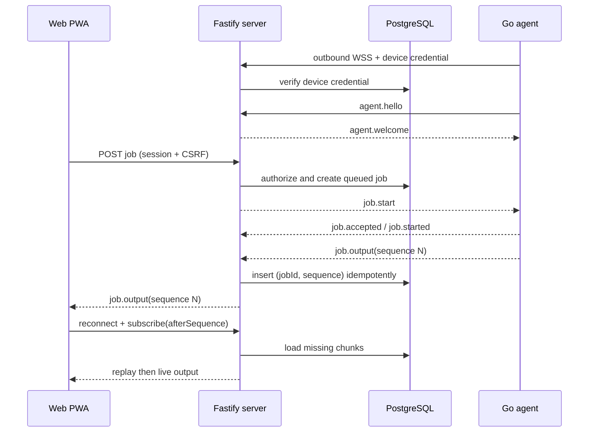

# Architecture

## Components

RelayDock has three runtime components and three shared TypeScript packages:

- `apps/server`: Fastify REST API, browser and agent WebSocket relay, authentication, authorization, audit, and persistence.
- `apps/web`: React/Vite installable mobile web client with xterm.js.
- `apps/agent`: single Go binary that pairs, connects outbound, validates repositories, and owns local processes and PTYs.
- `packages/protocol`: versioned Zod message schemas and limits.
- `packages/config`: non-secret defaults and stable names.
- `packages/shared`: domain helpers shared by TypeScript services.

PostgreSQL is authoritative for users, sessions, devices, credentials, repositories, actions, jobs, output chunks, pairing records, and audit events. Presence and active socket routing are deliberately ephemeral server state.

## Connection and execution flow

## Persistence ownership

The agent owns the running process because a browser must be disposable. Direct PTY processes remain alive as long as the agent process does. During a server/network interruption, the agent retains a bounded ring of recent output and syncs missing sequence numbers after reconnecting. PostgreSQL retention is independently capped per job and by age.

## Authorization invariants

Every normal API lookup begins with the authenticated user ID. A job can be dispatched only when its device and repository are owned by that user, the repository belongs to that device, and the device has a currently authenticated socket. Agent-originated job messages are accepted only when the job belongs to that socket's device. Browser WebSocket subscriptions are accepted only for jobs owned by the browser session user.

Repository creation is a validation handshake, not a blind database insert. The server assigns a repository ID, the agent resolves and inspects the proposed absolute path, and only a successful response enables the record. At execution time the agent rechecks that the repository is in its validated registry and that the resolved working directory remains beneath its canonical root.

## Failure behavior

- No agent acknowledgement: the server fails or leaves the job disconnected after a bounded dispatch timeout.
- Agent disconnect during execution: active jobs become disconnected, not cancelled; reconnect reconciliation may resume output.
- Duplicate output: the database uniqueness constraint on `(jobId, sequence)` makes delivery idempotent.
- Cancellation/completion race: terminal states are final and state transitions are checked before mutation.
- Browser disconnect: no process action occurs.
- Device revocation: the active socket is closed and future credential verification fails.
- Permanent device deletion: only revoked devices can be deleted. RelayDock transactionally removes
  their jobs and retained output, repositories and actions, credentials, and device record while
  retaining security audit events with the former device identity in metadata.

Material changes to these boundaries require an ADR under `docs/decisions`.
